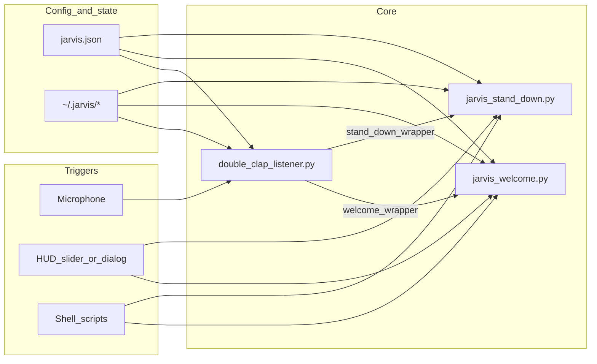
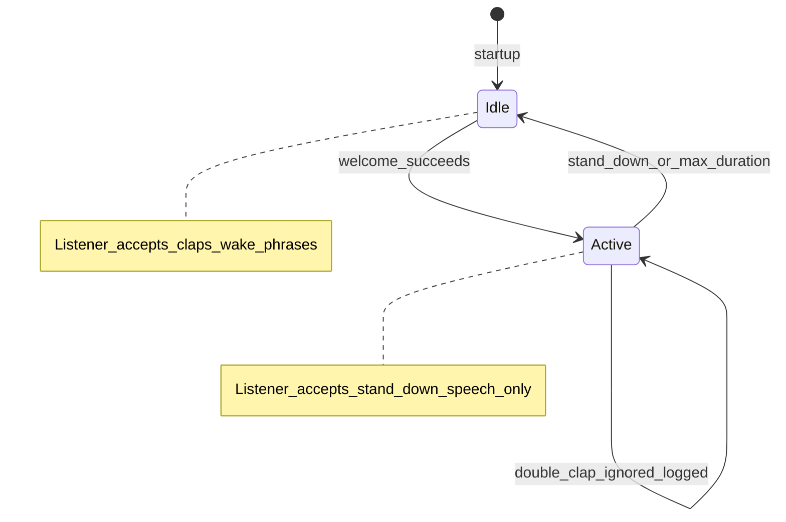

# 2 — Architecture

[← Back to index](README.md)

## High-level picture

Jarvis is intentionally **script-centric**: small programs orchestrated by shell wrappers, JSON config, and a few state files. The **double-clap listener** is the long-running process when you use hands-free mode; **welcome** and **stand-down** are separate invocations (from the listener, HUD, or Terminal).

## Lab session state machine

The **lab session** flag is the main mode switch for the listener.

**Important:** If `lab_session.json` says active, **double-claps do not run welcome again**; the listener logs a periodic reminder. Clear the session with stand-down, the HUD, or by removing the state file if stuck (see [11-troubleshooting.md](11-troubleshooting.md)).

## Data flow (simplified)

1. **Config** — Single JSON file (`JARVIS_CONFIG` or `config/jarvis.json`) defines voices, phrases, clap thresholds, HUD layout, apps, etc.
2. **State directory** — Default `~/.jarvis/`: session flag, wallpaper backup JSON, optional HUD lock, **`welcome.pid`** while welcome is running (stand-down can kill that process), **`dictation_text.txt`** (combined welcome lines for the HUD dictation overlay), `repository_path` for login HUD.
3. **Wallpaper** — `wallpaper_util.py` backs up current desktop pictures to JSON; welcome sets lab visuals; stand-down restores from that JSON.

## Component responsibilities

| Piece | Role |
|-------|------|
| `double_clap_listener.py` | Owns one mic stream; **clap mode** vs **phrase mode**; optional wake phrase path; optional file watcher `--watch`. |
| `jarvis_welcome.py` | Full welcome pipeline; writes `lab_session.json` only after successful completion. |
| `jarvis_stand_down.py` | Interrupts in-flight welcome via `welcome.pid`; restores wallpaper; quits apps; clears session file. |
| `jarvis_holographic_wallpaper.py` | Renders frames + `say` timing for holographic mode. |
| `wallpaper_util.py` | AppleScript backup / set / restore for desktop pictures. |
| `jarvis_hud_appkit.py` | Native HUD window (hover reveal, slider) plus optional **`hud_overlay`** windows; overlay **alpha follows lab session** (visible when `lab_session.json` is active, hidden after stand down). |
| `jarvis_hud_slider.py` | Tk slider fallback. |
| `jarvis_hud_dialog.py` | AppleScript list dialog fallback. |
| `jarvis_hud_lib.py` | Repo resolution, singleton lock, spawn welcome/stand-down. |
| `jarvis_doctor.py` | Read-only local diagnostics (config, imports, state, LaunchAgents, HUD runtime vs repo); run via **`jarvis_doctor.sh`**. |

## Related chapters

- [05-listener-and-speech.md](05-listener-and-speech.md) — listener internals
- [06-welcome-and-stand-down.md](06-welcome-and-stand-down.md) — script ordering
- [08-hud.md](08-hud.md) — HUD stack
