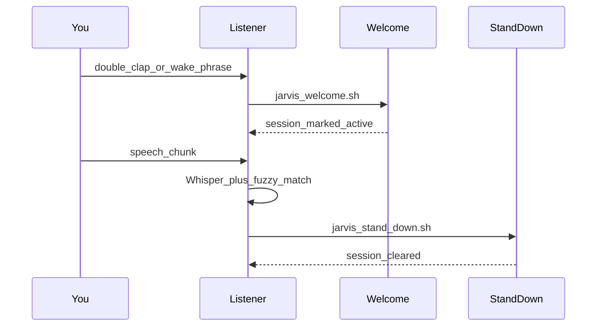

# 3 — User journeys

[← Back to index](README.md)

## Journey A — First-time setup

1. Clone the repo and create a venv: `python3 -m venv .venv && source .venv/bin/activate && pip install -r requirements.txt`.
2. Copy `config/jarvis.example.json` → `config/jarvis.json` and edit paths, voices, Shortcut names, phrases.
3. In **Shortcuts**, create two shortcuts whose names match `shortcut_focus_on` and `shortcut_focus_off`.
4. Grant **Microphone** to the Python you will use (Terminal during tests; `.venv/bin/python3` for LaunchAgent).
5. Run a manual welcome: `./scripts/jarvis_welcome.sh` with `JARVIS_CONFIG` set.
6. Run stand-down: `./scripts/jarvis_stand_down.sh`.
7. Test the listener in a Terminal: `python3 scripts/double_clap_listener.py` — double-clap for welcome, speak stand-down when the session is active.

*In practice:* keep `clap.debug` on briefly while tuning `peak_threshold` so you can see peaks in the log.

## Journey B — Daily hands-free use (listener installed)

1. Log in; LaunchAgent starts `double_clap_listener.py` (same Python as install).
2. **Idle:** double-clap triggers welcome (or use a **wake phrase** if configured).
3. **Lab active:** speak a **stand-down phrase**; Whisper + fuzzy match in `jarvis_phrase.py` decides if it counts.
4. If something misbehaves, check `~/.jarvis/listener.log` and `listener.err.log`.

## Journey C — HUD-only day (meetings, broken mic)

1. Do not rely on the listener; use `./scripts/jarvis_hud_slider.sh` (AppKit → Tk → dialog) or `./scripts/jarvis_hud_dialog.sh` directly.
2. Pick **Welcome** or **Stand down** from the UI; the HUD spawns the same shell entrypoints as manual runs.
3. For login startup without Terminal, use `install_hud_login.sh` (see [09-installation-and-launchd.md](09-installation-and-launchd.md)).

## Journey D — Debugging “nothing happens”

1. **Lab already active?** Stand down or remove `~/.jarvis/lab_session.json` if stale.
2. **Listener not running?** `launchctl list | grep jarvis` and logs under `~/.jarvis/`.
3. **HUD invisible?** `JARVIS_HUD_DEBUG_VISIBILITY_MODE=always_visible` then `titled_debug` (see [08-hud.md](08-hud.md)).
4. **Claps unreliable?** `clap.debug`, fix `peak_threshold`, consider wired mic instead of Bluetooth.

## Related chapters

- [09-installation-and-launchd.md](09-installation-and-launchd.md) — LaunchAgents
- [11-troubleshooting.md](11-troubleshooting.md) — symptom index
