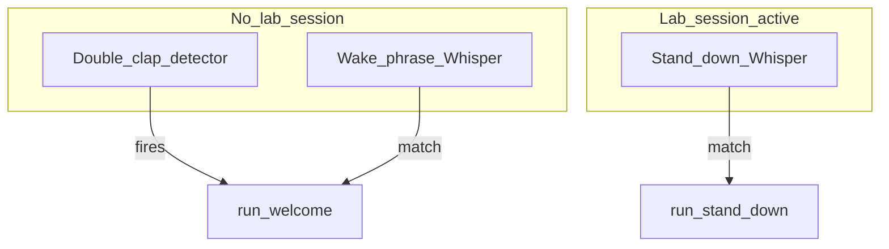

# 5 — Listener and speech

[← Back to index](README.md)

## Role of `double_clap_listener.py`

The listener is the **always-on microphone service** when you use hands-free mode. It:

1. Captures mono audio via **sounddevice** at the configured sample rate.
2. Runs **clap detection** when no lab session is active (and optionally **wake phrase** detection).
3. Switches to **phrase mode** when `lab_session.json` marks an active session — then it buffers audio, runs **faster-whisper**, and matches text against `stand_down_phrases` using **`phrase_matches`** from `jarvis_phrase.py`.
4. Invokes **`jarvis_welcome.sh`** and **`jarvis_stand_down.sh`** (not bare `.py` files) so the same venv / environment as a manual run is preserved.

## Listener modes

**Wake phrases** (`wake_phrases` in JSON) are evaluated **only in clap mode** (no active lab). They use the same Whisper model settings as stand-down. If `faster-whisper` is missing when wake phrases are configured, the listener prints an error and **clears** wake phrases at runtime to avoid a broken loop.

**Stand-down** runs when transcribed text matches any configured phrase with fuzzy logic (handles Whisper glitches like “jarvus” → “jarvis”).

## Clap detection internals (`ClapDetector`)

The detector looks for **two broadband transients** within a min/max gap:

- **Peak threshold** — adaptive calibration can raise the effective threshold from measured noise (`adaptive_calibration`).
- **Hysteresis** — requires a quiet dip between claps.
- **Spectral flatness** — each candidate onset must pass **`_is_clap_shaped`**: broadband transients (typical claps) meet `min_spectral_flatness_db`; sustained speech-like blocks do not.
- **Onset duration** — if the first hit stays above threshold longer than **`max_onset_duration_ms`**, the detector resets (not a short clap).
- **Cooldown** — prevents repeated triggers (`cooldown_seconds`).

*Tuning tip:* enable `clap.debug` to print `peak`, threshold, **flatness in dB**, and whether the block counts as broadband.

## Calibration

On startup, **~1.2 s** of background noise is sampled (`calibrate_seconds`; set to **0** to skip). Stay quiet. When **`adaptive_calibration`** is `true` (default), the listener **raises** `peak_threshold` using percentiles (including **p95** as a noise ceiling). Set **`adaptive_calibration`** to **`false`** to keep your JSON `peak_threshold` exactly (still prints a line that adaptive adjust was skipped).

## Lab session timeout

If `lab_session_max_minutes` is positive and exceeded, the listener prints a message and calls **stand-down** automatically.

## Holographic wallpaper sync

On startup, if holographic mode is enabled **and** a lab session is already active, the listener calls **`apply_black_wallpaper`** so the desktop stays on the black “lab” base after a restart without running welcome again.

## File watcher

`python3 scripts/double_clap_listener.py --watch` (or `-w`) restarts the listener when `jarvis.json` or `scripts/*.py` change — useful while tuning.

## Input device selection

- `clap.input_device` can be `null` (default device), an **integer index**, or a **substring** of the device name.
- Run `python3 scripts/list_audio_devices.py` to see indices and names.
- **Validation:** if the configured index is not an input device (or is invalid after an OS update), the listener logs a warning and falls back to the **system default** mic.

## Related files

| File | Role |
|------|------|
| [`jarvis_phrase.py`](../scripts/jarvis_phrase.py) | Normalize + fuzzy match for phrases. |
| [`phrase_listener.py`](../scripts/phrase_listener.py) | Thin re-export of `phrase_matches` for tests/imports. |

## Related chapters

- [06-welcome-and-stand-down.md](06-welcome-and-stand-down.md) — what welcome/stand-down do
- [04-configuration.md](04-configuration.md) — `clap.*` and `phrase.*` keys
