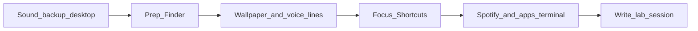
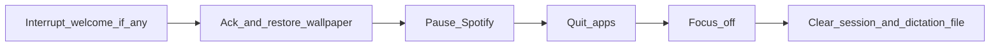

# 6 — Welcome and stand down

[← Back to index](README.md)

Entry points:

- **Shell:** [`jarvis_welcome.sh`](../scripts/jarvis_welcome.sh), [`jarvis_stand_down.sh`](../scripts/jarvis_stand_down.sh) — prefer these; they select `.venv/bin/python3` when present.
- **Python:** [`jarvis_welcome.py`](../scripts/jarvis_welcome.py), [`jarvis_stand_down.py`](../scripts/jarvis_stand_down.py).

## Welcome pipeline (ordered)

The welcome script **exits early** if a lab session is already active (unless you clear state). It writes **`welcome.pid`** at the **start** of the main try block so stand-down can interrupt a long welcome (SIGTERM, then SIGKILL if needed).

Approximate order (matches [`jarvis_welcome.py`](../scripts/jarvis_welcome.py) `main()`):

1. **Optional** `welcome_sound` via `afplay`.
2. **Backup** current desktop pictures → `wallpaper_restore.json` (via `wallpaper_util.py backup`).
3. **Desktop prep** — activate Finder, optional Hide Others (`welcome_prepare_desktop`, `welcome_hide_other_apps`).
4. **Wallpaper prep** — holographic on: `apply_black_wallpaper`; holographic off: **`_set_lab_wallpaper`** with the **combined** welcome text as a single static lab image (then each line is still spoken separately in step 6).
5. **`dictation_text.txt`** — write the **space-joined** welcome lines to **`state_dir/dictation_text.txt`** so the AppKit HUD **dictation** overlay can animate them (updated **before** the per-line speech loop). Failures are ignored if the file cannot be written.
6. **Voice lines** — for each welcome line, **`speak_jarvis_line`**: full holographic typing when holo is enabled, otherwise **`run_cli_say`** only.
7. **Black wallpaper** again after holographic lines if enabled (cleanup beat).
8. **Shortcuts** — `shortcut_focus_on`, then `welcome_shortcuts_chain`.
9. **Spotify stinger** — background thread: `open -g -j` Spotify, wait for process, `play track`, sleep `music_preview_seconds`, pause; optionally **dock** lab apps behind desktop after playback starts.
10. **Apps** — open Kiro and Cursor with background/hidden flags; optional `_dock_lab_behind_desktop` after delay.
11. **Terminal codex/claude** — optional delayed timer (`welcome_delay_terminal_seconds`, etc.) when `terminal_open_codex_claude` is true.
12. **Wait** for Spotify thread (with generous join timeout).
13. **Write `lab_session.json`** — `active: true`, `started` timestamp. **Only after success** so crashes do not leave a false “active” session without you noticing (pid file still helps).

## Stand-down pipeline

1. If **`welcome.pid`** exists, **SIGTERM** (then **SIGKILL** if needed) to stop a running welcome.
2. Optional **`stand_down_sound`**.
3. **Acknowledgment**
   - If holographic ack enabled: `speak_jarvis_line` for `stand_down_ack_message`, then **restore** wallpaper from JSON.
   - Else restore wallpaper first as needed, then plain `say` ack if enabled.
4. **Pause Spotify**.
5. **Quit apps** — merged list: `stand_down_apps_quit` + optional Terminal + optional Spotify per flags.
6. **`shortcut_focus_off`**.
7. **Second wallpaper restore pass** (desktop state may have changed).
8. **Delete `lab_session.json`**.
9. **Remove `dictation_text.txt`** from `state_dir` (so the HUD dictation overlay clears).
10. If ack was skipped for holographic path but voice ack still needed in non-holo mode, **`run_cli_say`** via stand-down’s `_say` helper.

## Iron Man–style options (from README)

- Terminal + **`codex` / `claude`** is **off** by default (`terminal_open_codex_claude`); enable if you want that flow.
- Kiro has **no stable public API** assumed — Jarvis uses `open` + AppleScript patterns.

## Related chapters

- [07-wallpaper-and-holographic.md](07-wallpaper-and-holographic.md) — holographic details
- [05-listener-and-speech.md](05-listener-and-speech.md) — how listener triggers these scripts
