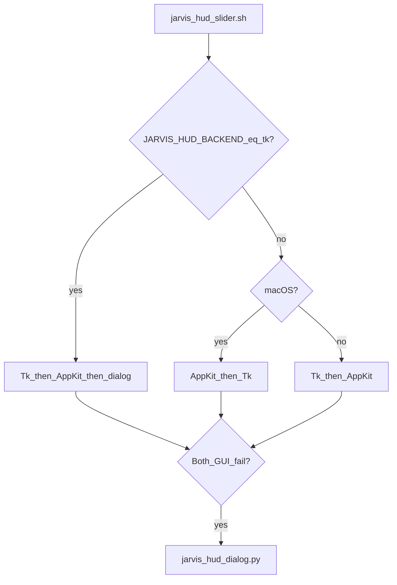

# 8 — Desktop HUD (manual control)

[← Back to index](README.md)

When you cannot **double-clap** or speak **stand-down phrases**, the **HUD** gives the same actions as the listener: **Welcome** and **Stand down**, via a small on-screen control.

## Backends (three implementations)

| Backend | Script | Notes |
|---------|--------|--------|
| **AppKit** (preferred on macOS) | [`jarvis_hud_appkit.py`](../scripts/jarvis_hud_appkit.py) | Borderless **liquid-glass** slider, hover reveal near screen edge, PyObjC/Cocoa. |
| **Tk** | [`jarvis_hud_slider.py`](../scripts/jarvis_hud_slider.py) | Fallback if AppKit unavailable; different **left/right semantics** (see below). |
| **Dialog** | [`jarvis_hud_dialog.py`](../scripts/jarvis_hud_dialog.py) | No Tk; AppleScript `choose from list` + optional confirm for stand-down. |

The wrapper **[`jarvis_hud_slider.sh`](../scripts/jarvis_hud_slider.sh)** picks a Python and backend:

**Direct dialog:** [`jarvis_hud_dialog.sh`](../scripts/jarvis_hud_dialog.sh) runs the dialog HUD only.

**Probe logic:** The shell does **not** treat a bare `objc` import as enough — it imports `jarvis_hud_appkit` and checks `_HAVE_COCOA`.

## Shared library: `jarvis_hud_lib.py`

- **`repo_root()`** — From `JARVIS_REPO_ROOT`, sibling `config`/`scripts` dirs, or `~/.jarvis/repository_path` (used by login app copies).
- **`acquire_hud_singleton`** — File lock `hud.instance.lock` so only one HUD runs.
- **`spawn_welcome` / `spawn_stand_down`** — Prefer executing `jarvis_welcome.sh` / `jarvis_stand_down.sh` with `JARVIS_CONFIG`; fall back to opening a Terminal/iTerm tab with the command if direct execute fails.

## Lab chrome overlay (`hud_overlay`)

When the **AppKit** HUD runs, it can create **additional borderless windows** above the desktop (non-interactive, click-through), controlled by the **`hud_overlay`** object in `jarvis.json`. See [04-configuration.md](04-configuration.md) for every key; this section explains the idea.

| Layer | What it does |
|-------|----------------|
| **Background** | One window per **NSScreen**: dim / grid / scan-line style fill (`JarvisBackgroundView`). |
| **Arc reactor** | Centered on the **main** display: animated rings and orbiting particles (`JarvisArcReactorView`). |
| **Dictation** | A horizontal strip showing **character-by-character** text read from **`state_dir/dictation_text.txt`**. **Welcome** writes that file (all welcome lines joined with spaces) before speaking; **stand down** deletes it. The view polls file **mtime** to restart typing when the file changes. |

**In practice:** set **`hud_overlay.enabled`** to **`false`** if you only want the slim slider with no extra chrome. **Tk** and **dialog** backends do **not** implement this overlay.

Timers in AppKit advance overlay animation (~24 fps) and poll the dictation file.

## AppKit HUD behavior (normal mode)

Config under **`hud_slider`** in JSON (see [04-configuration.md](04-configuration.md)).

- Starts **hidden**; moving the pointer into **`hover_zone_px`** of the **top** or **bottom** edge (per `position`) reveals the control.
- Hides after **`hide_delay_seconds`** when the cursor leaves both the edge band and the HUD window.
- **Semantics:** knob on the **left** = standby; **right** = operational. Moving **left → right** triggers **welcome** when the lab is inactive; **right → left** triggers **stand down** (no confirmation dialog in AppKit).
- **Right-click** quits the HUD process.
- **`debug_visibility_mode`:** `normal` | `always_visible` | `titled_debug` — also overridable via `JARVIS_HUD_DEBUG_VISIBILITY_MODE`.

## Tk vs AppKit: opposite drag directions

**Important:** the legacy **Tk** slider uses the **older** mapping:

- Drag **left** (low value) → **Welcome**
- Drag **right** (high value) → **Stand down** (optional confirm)

The **AppKit** HUD uses the **new** mapping (see file header in `jarvis_hud_appkit.py`):

- **Right** side → **Welcome** (operational)
- **Left** side → **Stand down** (standby)

If you switch backends, expect the **same screen position** to mean different actions. When in doubt, use the **dialog HUD**, which spells out the actions in words.

## Dialog HUD

- Lists **Welcome (start lab)** and **Stand down (end lab)**.
- If welcome is chosen and a lab session is already active, shows an alert.
- Stand-down can require confirmation when **`hud_slider.confirm_stand_down`** is true.

## Login / standalone app

- **[`install_hud_login.sh`](../scripts/install_hud_login.sh)** copies **`macos/Jarvis HUD.app`** to **`~/Applications/`**, snapshots config to **`~/.jarvis/hud_config.json`**, copies HUD Python modules to **`~/.jarvis/hud_runtime/`**, writes **`~/.jarvis/repository_path`** and **`hud_python_path`**, and loads **`com.jarvis.hud`** LaunchAgent.
- The app **launcher** runs copied **`jarvis_hud_appkit.py`** from runtime with the recorded Python, or falls back to Tk runtime.

See [09-installation-and-launchd.md](09-installation-and-launchd.md) for logs and removal.

## Diagnostics

When run from Terminal, AppKit HUD prints build id, visibility mode, frames, blur vs fallback — first stop if the control does not appear.

## Related material

- Shorter reference: [`docs/HUD.md`](../docs/HUD.md)
- [03-user-journeys.md](03-user-journeys.md) — HUD-only journey
