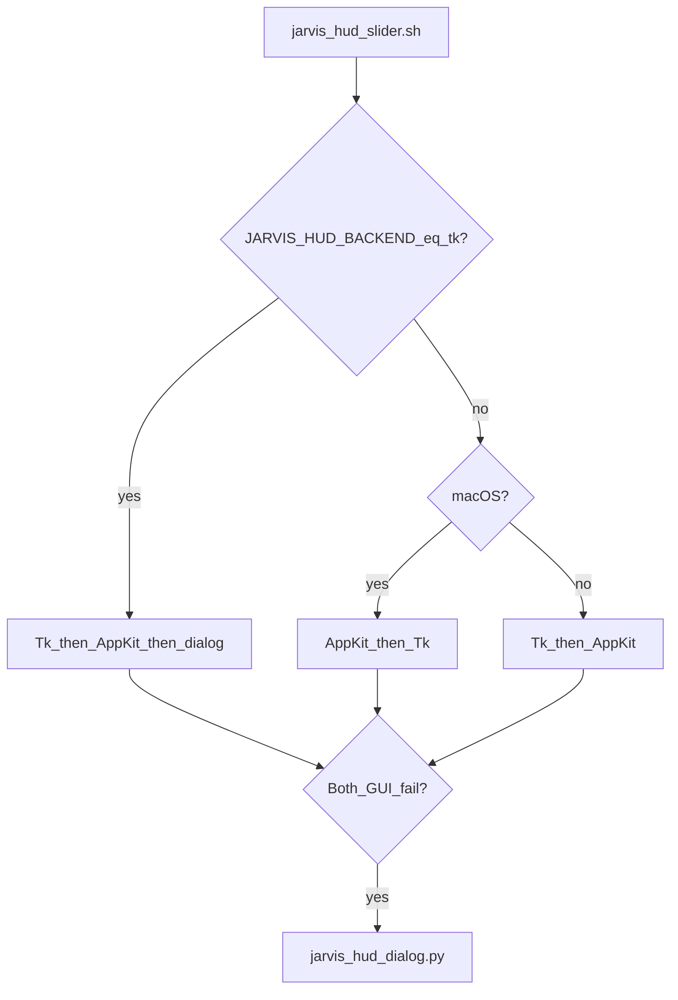

# 8 — Desktop HUD (manual control)

[← Back to index](README.md)

When you cannot **double-clap** or speak **stand-down phrases**, the **HUD** gives the same actions as the listener: **Welcome** and **Stand down**, via a small on-screen control.

## Backends (three implementations)

| Backend | Script | Notes |
|---------|--------|--------|
| **AppKit** (preferred on macOS) | [`jarvis_hud_appkit.py`](../scripts/jarvis_hud_appkit.py) | Borderless **liquid-glass** slider, hover reveal near screen edge, PyObjC/Cocoa. |
| **Tk** | [`jarvis_hud_slider.py`](../scripts/jarvis_hud_slider.py) | Fallback if AppKit unavailable; different **left/right semantics** (see below). |
| **Dialog** | [`jarvis_hud_dialog.py`](../scripts/jarvis_hud_dialog.py) | No Tk; AppleScript `choose from list` + optional confirm for stand-down. |

The wrapper **[`jarvis_hud_slider.sh`](../scripts/jarvis_hud_slider.sh)** picks a Python and backend:

**Direct dialog:** [`jarvis_hud_dialog.sh`](../scripts/jarvis_hud_dialog.sh) runs the dialog HUD only.

**Probe logic:** The shell does **not** treat a bare `objc` import as enough — it imports `jarvis_hud_appkit` and checks `_HAVE_COCOA`.

## Shared library: `jarvis_hud_lib.py`

- **`repo_root()`** — From `JARVIS_REPO_ROOT`, sibling `config`/`scripts` dirs, or `~/.jarvis/repository_path` (used by login app copies).
- **`acquire_hud_singleton`** — File lock `hud.instance.lock` so only one HUD runs.
- **`spawn_welcome` / `spawn_stand_down`** — Prefer executing `jarvis_welcome.sh` / `jarvis_stand_down.sh` with `JARVIS_CONFIG`; fall back to opening a Terminal/iTerm tab with the command if direct execute fails.

## Lab chrome overlay (`hud_overlay`)

When the **AppKit** HUD runs, it can create **additional borderless windows** (non-interactive, click-through) from **`hud_overlay`** in `jarvis.json`. See [04-configuration.md](04-configuration.md) for keys; behavior summary:

| Layer | What it does |
|-------|----------------|
| **Background** | One window per **NSScreen**: dim / grid / scan-line style fill (`JarvisBackgroundView`). |
| **Arc reactor** | Centered on the **main** display: animated rings and orbiting particles (`JarvisArcReactorView`). |
| **Dictation** | Horizontal strip: **character-by-character** text from **`state_dir/dictation_text.txt`**. **Welcome** writes the file (welcome lines joined with spaces) before speaking; **stand down** deletes it. **mtime** changes restart the typing animation. |

**Stacking order:** background, arc, and dictation windows are set to **desktop level** (`NSNormalWindowLevel - 1` in code) so they sit **behind normal application windows** — you see them on the **desktop picture**, not on top of Safari or your IDE. The **glass slider** and optional **edge sensor** strips use **floating** level (`NSFloatingWindowLevel`) so they sit **above** normal windows and receive mouse events: the slider is the large visible control; sensors are thin strips for edge dwell / hover (the logical edge band depth is still **`hud_slider.hover_zone_px`**). Overlay chrome stays at desktop level only.

**In practice:** set **`hud_overlay.enabled`** to **`false`** if you only want the slim slider with no extra chrome. **Tk** and **dialog** backends do **not** implement this overlay.

### When overlays are visible

Overlay windows are **built at HUD startup** with **opacity 0**. The delegate then:

1. Reads whether a lab session is already active (`lab_session.json`).
2. If **active**, calls **`_show_overlays()`** — animates overlay windows to **fully visible** (~0.6s).
3. A **0.5s timer** compares `lab_active` to the previous sample: transition **inactive → active** shows overlays; **active → inactive** (e.g. after stand down) runs **`_hide_overlays()`** — fades them back to **transparent** (~0.5s).

So the arc/grid/dictation chrome is **not** on screen between stand-down and the next welcome, even if the HUD process keeps running. The **dictation** view still advances from **`dictation_text.txt`** on animation ticks while the overlay windows exist; when hidden, you simply do not see them.

**Timers:** ~24 fps drives arc / dictation animation; dictation also reacts when the text file’s modification time changes.

## AppKit HUD behavior (normal mode)

Config under **`hud_slider`** in JSON (see [04-configuration.md](04-configuration.md)).

- Starts **hidden**; in the default **`reveal_mode = edge_dwell`**, the pointer must stay inside **`hover_zone_px`** at the **top** or **bottom** edge (per `position`) for **`reveal_dwell_seconds`** before the slider animates in. **`reveal_mode = edge`** (aliases: `immediate`, `edge_immediate`, `hover`) reveals as soon as the cursor enters the band.
- Hides after **`hide_delay_seconds`** when the cursor leaves both the edge band and the HUD window.
- **Knob vs lab session:** when the slider **first becomes visible**, the knob **syncs from `lab_active`**: **right** (operational) if a session is already active, **left** (standby) if idle — so the control matches state after peek-on-launch or reopening the HUD.
- **Semantics:** knob **left** = standby; **right** = operational. Moving **left → right** triggers **welcome** when the lab is inactive; **right → left** triggers **stand down** (no confirmation dialog in AppKit; use **dialog HUD** for `confirm_stand_down`).
- **Quit:** **right-click** the slider for a context menu, or **Control-click** (same menu).
- **`debug_visibility_mode`:** `normal` | `always_visible` | `titled_debug` — also overridable via `JARVIS_HUD_DEBUG_VISIBILITY_MODE`.
- **`peek_on_launch_seconds`** (when `debug_visibility_mode` is **`normal`**): if **greater than 0**, the slider **shows immediately** for that many seconds (then hides unless the cursor is in the hover zone). Helps discover the control on first launch. Same key is documented for Tk layout; AppKit honors it too.

## Tk vs AppKit: opposite drag directions

**Important:** the legacy **Tk** slider uses the **older** mapping:

- Drag **left** (low value) → **Welcome**
- Drag **right** (high value) → **Stand down** (optional confirm)

The **AppKit** HUD uses the **new** mapping (see file header in `jarvis_hud_appkit.py`):

- **Right** side → **Welcome** (operational)
- **Left** side → **Stand down** (standby)

If you switch backends, expect the **same screen position** to mean different actions. When in doubt, use the **dialog HUD**, which spells out the actions in words.

## Dialog HUD

- Lists **Welcome (start lab)** and **Stand down (end lab)**.
- If welcome is chosen and a lab session is already active, shows an alert.
- Stand-down can require confirmation when **`hud_slider.confirm_stand_down`** is true.

## Login / standalone app

- **[`install_hud_login.sh`](../scripts/install_hud_login.sh)** copies **`macos/Jarvis HUD.app`** to **`~/Applications/`**, snapshots config to **`~/.jarvis/hud_config.json`**, copies HUD Python modules to **`~/.jarvis/hud_runtime/`**, writes **`~/.jarvis/repository_path`** and **`hud_python_path`**, and loads **`com.jarvis.hud`** LaunchAgent.
- The app **launcher** runs copied **`jarvis_hud_appkit.py`** from runtime with the recorded Python, or falls back to Tk runtime.

See [09-installation-and-launchd.md](09-installation-and-launchd.md) for logs and removal.

## Diagnostics

When run from Terminal, AppKit HUD prints **stderr** diagnostics including **build id**, **visibility mode**, **blur** host, **`reveal=`** (reveal mode), **`dwell=`** (seconds), **hover** px, **poll** interval, **visibleFrame**, **window** / **slide** rects, **slideHidden**, **slideAlpha** — first stop if the control does not appear.

## Related material

- Shorter reference: [`docs/HUD.md`](../docs/HUD.md)
- [03-user-journeys.md](03-user-journeys.md) — HUD-only journey
- [09-installation-and-launchd.md](09-installation-and-launchd.md) — **`jarvis_doctor`** (HUD runtime drift, PyObjC, LaunchAgents)
